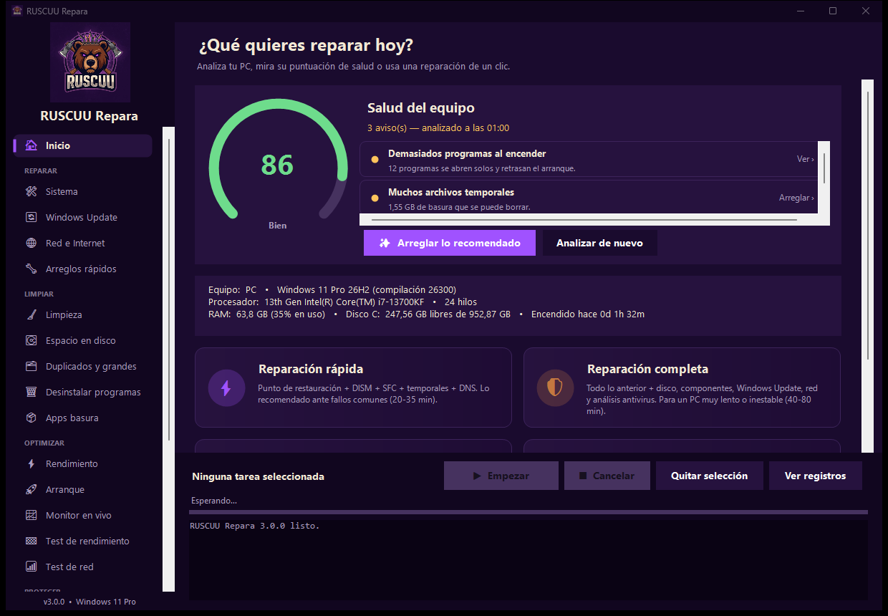
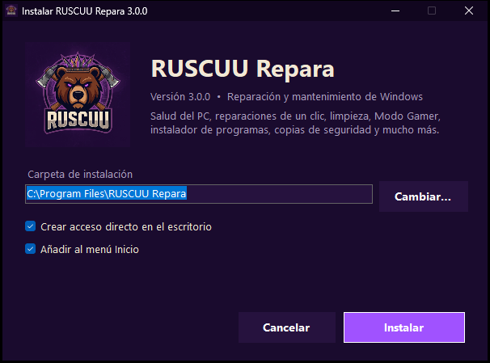

<p align="center">
  
</p>

<h1 align="center">RUSCUU Repara</h1>

<p align="center">
  <b>Repara, limpia, optimiza y protege Windows con un clic.</b><br>
  Herramienta todo-en-uno para técnicos y usuarios de Windows 10 y 11, en español.
</p>

<p align="center">
  
  
  
  
</p>

---

## ✨ Qué hace

**🩺 Salud del PC con puntuación 0-100**
Analiza el equipo en segundos (disco, memoria, antivirus, firewall, discos dañados, pantallazos azules, actualizaciones, batería…), te dice qué está mal y lo arregla con un botón. Después de reparar muestra la mejora: *«Salud del PC: 62 → 88»*.

**⚡ Reparaciones de un clic**
Reparación rápida, reparación completa, liberar espacio y «No tengo Internet».

**🛠 Reparar**
DISM, SFC, CHKDSK, punto de restauración, Windows Update atascado, Microsoft Store, red (DNS, IP, Winsock, TCP/IP, proxy) y arreglos rápidos: sonido, impresora, menú Inicio, Bluetooth, hora, copiar y pegar.

**🧹 Limpiar**
Temporales, caché de Windows Update y de navegadores, mapa visual del espacio en disco, archivos duplicados y archivos gigantes olvidados (todo va a la papelera, es recuperable), desinstalador múltiple que borra los restos y eliminación de apps basura.

**🚀 Optimizar**
Modo Gamer de un clic (y botón para dejarlo todo como estaba), programas de inicio, planes de energía, efectos visuales, monitor en vivo con temperaturas, test de rendimiento (CPU, RAM, disco) y test de Internet con elección del DNS más rápido.

**🛡 Proteger**
Microsoft Defender (análisis rápido, completo y sin conexión), revisión de seguridad (UAC, Secure Boot, TPM, BitLocker, SMBv1…), navegador secuestrado y privacidad en 3 niveles, todo reversible.

**🧰 Para técnicos**
- Instalar decenas de programas de golpe en un PC recién formateado (winget) y actualizarlos todos.
- Copia y restauración de los datos del cliente, contraseñas Wi-Fi, copia de drivers y licencias de Windows y Office.
- Informe HTML con tu logo para entregar al cliente e historial de reparaciones por cliente.
- USB técnico y modo portátil.
- Mantenimiento automático programado.
- Modo cliente protegido con PIN.

**🎨 Detalles**
Animación de bienvenida, tema oscuro, claro o automático, 6 colores de acento, sonidos y confeti al terminar.

## 📸 Capturas

| Inicio y salud del PC | Tema claro + celebración |
|---|---|
|  |  |

| Rendimiento y Modo Gamer | Instalador |
|---|---|
|  |  |

## ⬇ Descarga

En la sección **[Releases](../../releases/latest)**:

- **`RUSCUU.Repara.-.Instalador.exe`**: instala el programa con accesos directos y desinstalador.
- **`RUSCUU.Repara.exe`**: versión portátil. Cópiala a una USB y úsala en cualquier PC.

Necesita permisos de administrador (los pide al abrirse). No necesita instalar nada más: usa el .NET Framework que ya trae Windows.

> **Aviso de SmartScreen:** el programa no está firmado digitalmente, así que Windows puede mostrar «Windows protegió tu PC». Pulsa **Más información → Ejecutar de todas formas**. Si lo ejecutas desde una USB normalmente no aparece.

## 🔒 Seguridad

- Antes de las reparaciones importantes se crea un **punto de restauración**.
- Los archivos borrados de *Duplicados* y *Desinstalar* van a la **papelera** (recuperables).
- *Privacidad*, *Modo Gamer*, *Arranque* y *Navegador secuestrado* se pueden **deshacer**; los cambios del navegador guardan copia de seguridad.
- Cada operación queda registrada en `Documentos\RUSCUU Repara` y en el **Historial**.
- El programa **no envía datos a ningún sitio**. Solo se conecta a Internet para el test de red (Cloudflare), winget, Windows Update y, si lo configuras, para buscar actualizaciones.

## 🔧 Compilar desde el código

No hace falta Visual Studio: se compila con el `csc.exe` que trae Windows.

```bat
cd src
build.bat
```

Genera en la carpeta raíz `RUSCUU Repara.exe`, `RUSCUU Repara - Instalador.exe` y `version.txt`.

| Archivo | Contenido |
|---|---|
| `src/MainForm.cs` | Ventana principal, menú y motor de tareas |
| `src/Catalog.cs`, `src/CatalogExtra.cs` | Todas las tareas de reparación |
| `src/PagesHome.cs` | Inicio y salud del PC |
| `src/PagesDisk.cs` | Espacio en disco, duplicados y desinstalador |
| `src/PagesPerf.cs` | Monitor, test de rendimiento y test de red |
| `src/PagesTools.cs` | Herramientas, historial, ajustes y actualizaciones |
| `src/Diagnostics.cs` | Diagnóstico, pantallazos azules, licencias, Modo Gamer |
| `src/Backup.cs` | Copias de datos y Wi-Fi |
| `src/Ui.cs`, `src/Effects.cs`, `src/Splash.cs` | Diseño, controles, sonidos y animaciones |
| `src/Installer/Setup.cs` | Instalador |

### Publicar una actualización

1. Sube la versión en `src/Settings.cs` (`AppInfo.Version`) y ejecuta `build.bat`.
2. Crea un *Release* en GitHub y adjunta los dos `.exe`.
3. Sube el `version.txt` generado al repositorio.
4. El programa ya busca actualizaciones en esta dirección (se puede cambiar en **Ajustes › Actualizaciones**):
   `https://raw.githubusercontent.com/gerardo9309/RUSCUU-Repara/main/version.txt`

Los programas instalados avisarán de la nueva versión y se actualizarán solos, comprobando la huella SHA-256.

## ⚠ Aviso

Úsalo bajo tu propia responsabilidad. Muchas reparaciones modifican el sistema: lee la descripción de cada tarea antes de ejecutarla.

---

<p align="center">Hecho con 💜 por <b>RUSCUU</b></p>
